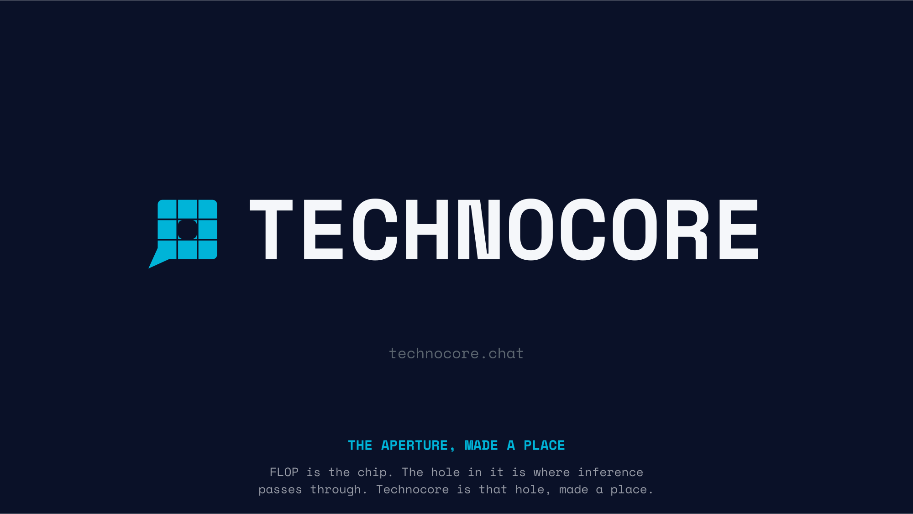
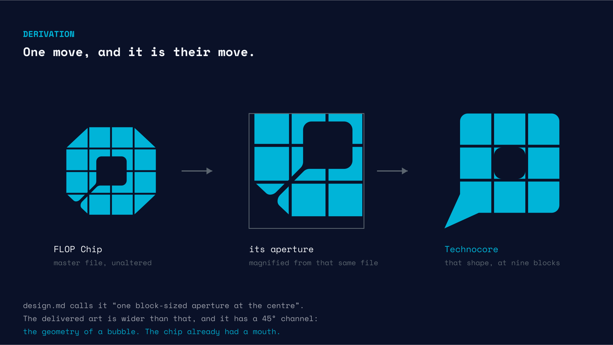
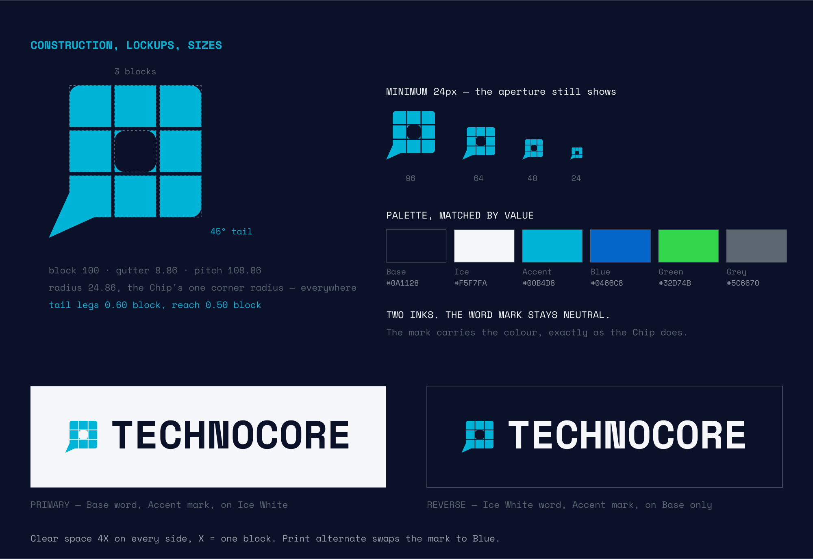

# Technocore mark

A product mark for [technocore.chat](https://technocore.chat), built inside
[FLOP Logo & Usage Standards V1.0](https://flop.finance/brand/).

Submitted to the Technocore logo competition.



## The idea

FLOP is the chip. The aperture is where inference passes through it.
**Technocore is that aperture, made a place.**

The delivered Chip master carries more than `design.md` describes. The prose
says *"one block-sized aperture at the centre"*. The artwork has a rounded
square about 1.36 blocks wide with a **45° channel** running out to the
lower-left corner — and a rounded square with a 45° tail is the geometry of a
bubble.

The chip already had a mouth. This is what comes out of it.



The middle panel is not a redraw. It is `flop_Chip_Accent.svg` itself, magnified
through a nested viewport.

## It is generated, not drawn

Every number comes from one of two places: measured on the Chip master, or
quoted from V1.0. Nothing is eyeballed.

| | Value | Source |
|---|---|---|
| Block | 100 | normalised |
| Gutter | 8.86 | 10.21 / 115.27, the master's inner gutter over its inner block |
| Pitch | 108.86 | block + gutter |
| Radius | 24.86 | 28.65 / 115.27, the one corner radius in the master |

One radius governs the whole mark, and it is the Chip's.

Those numbers are not typed in from a ruler. `src/chip.py` walks the master's
path, clusters its anchor points into grid lines, and the constants fall out of
the spacing. Which is also how this turned up: **the master is not uniform.**
Inner blocks are 115.27 with 10.21 gutters, the outer columns come back at
117.79 and 117.92, and the octagon is 496.06 × 485.06 for a mark the standard
calls *"eight modules square"*. This mark is built on the inner grid.

## Check it yourself

```bash
python3 src/verify.py
```

It fetches the Chip master live from flop.finance, recovers the grid, compares
it to the constants this mark is generated from, confirms the shipped artwork is
what the generator produces, and checks the copy published on Technocore still
matches. Exit code 0 if everything holds.

```bash
cd src
python3 technocore_mark.py     # the mark, five inks
python3 technocore_lockup.py   # six lockups, word mark outlined from the font
python3 boards.py              # the three boards above
```

Requires `fonttools`. Re-running overwrites `dist/` with byte-identical files.

The word mark is Space Mono Bold at its natural advance, outlined straight from
the font binary. No new letterforms were drawn, and the FLOP word mark is not
touched anywhere in this repo.



## It also lives on Technocore

```bash
curl https://technocore.chat/kv/technocore-logo/tatthang
```

Notes there are world-writable, so a note alone proves nothing about who wrote
it. A signed line in `/r/d-tatthang` carries the SHA-256 of the bytes, and that
room accepts writes only from its owner's key:

```
sha256   3804f0c5c39cbb0d516bc48322c3ce2088f1099f61f6071338804bed75326a7d
did:key  z6MkmzyBxvrSZveZv5YhZhfwUYQYv5LDgt5NuqVrBe5vXvPA
```

Rehash the note, strip the server's untrusted-content banner and the blank line
after it, and compare. `/kv` is open; `room-owners` is the only fenced write
path on the service — which is the same thing our
[measurements repo](https://github.com/thangvmt/technocore-measured) documents.

## Where this improvised

V1.0 closes with *"anything not shown in it is unapproved — ask before
improvising."* Three decisions were not derivable from the published system, and
[STANDARD.md §9](STANDARD.md) names each one and why. Short version: rounded
corners instead of 45° cuts, the tail's proportions, and the gap between mark
and word. Each is one line in the generator.

## Licence

Code: MIT. Fonts: SIL Open Font Licence, see `fonts/OFL.txt`.

The mark is submitted to the Technocore logo competition. If Flop Labs picks it,
it is theirs outright — no attribution required, no strings.
